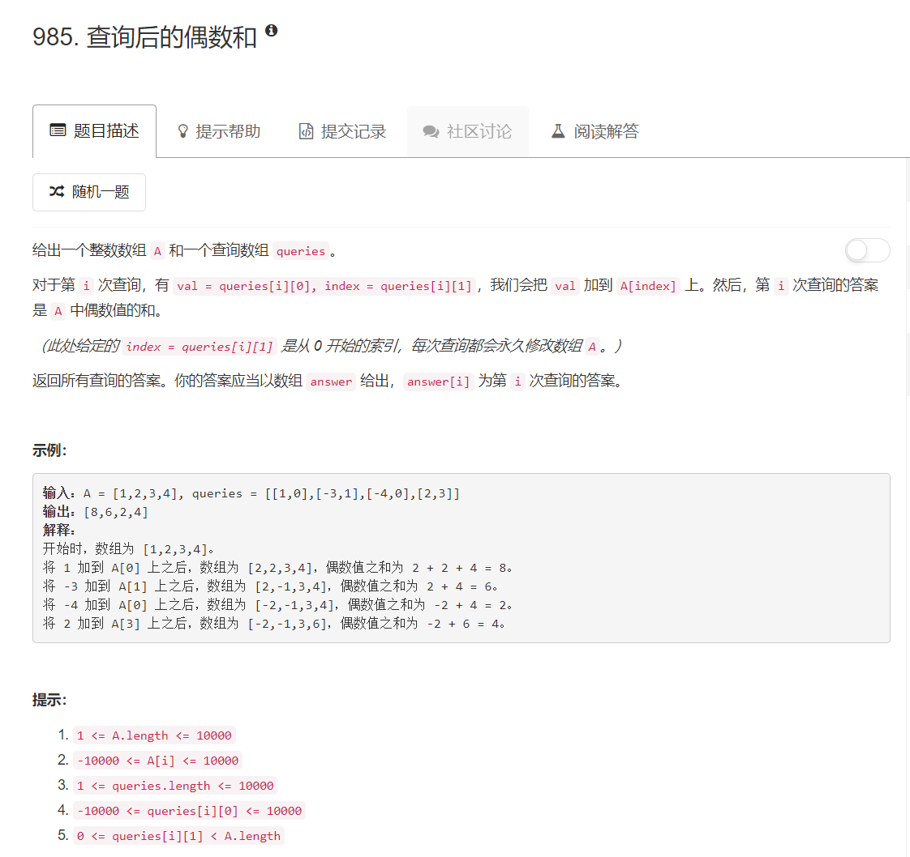

# 985 - 查询后的偶数和  

## 题目描述


## 题解一
思路：  
1. 要快，找一个不用每次都从整个数组中求偶数和的办法；
2. 先计算原数组中偶数之和；
3. 根据两数之和的奇偶情况分类：
	- 同为奇数或同为偶数的两数之和为偶数：
		- 若原数组中元素为偶数，则其已经加进origin_sum中了，此时将新的val加进去即可；
		- 若原数组中元素为奇数，则其没有加进origin_sum中，此时将原数组中此位置的元素和新的val一同加进去；
	- 一奇一偶之和为奇数：
		- 若原数组中元素为偶数，则其已经加进origin_sum中了，加上val之后此位置会变成奇数所以要将其减去；
		- 若原数组中元素为奇数，则其没有加进origin_sum中，此时偶数和不会改变所以不用管；

beat 38.1%.
```python
class Solution(object):
    def sumEvenAfterQueries(self, A, queries):
        """
        :type A: List[int]
        :type queries: List[List[int]]
        :rtype: List[int]
        """
        res = []
        origin_sum = sum([i for i in A if i%2 == 0 ])
        print(origin_sum)
        for item in queries:
        	val, index = item[0], item[1]
        	if A[index]%2 == val%2:		# 两数和为偶数
        		if A[index]%2 == 0: 	# 这个数是偶数，已经加进origin_sum中了，不用再将其加进去
        			A[index] += val
        			origin_sum += val
        		else:
        			A[index] += val
        			origin_sum += A[index]
        		
        	else: 						# 两数和为奇数
        		if A[index]%2 == 0:		# 这个数是偶数，已经加进origin_sum中了，加上val会变成奇数所以要将其减去
        			origin_sum -= A[index]
        			A[index] += val
        		else:
        			A[index] += val

        	res.append(origin_sum )
        return res
```

## 题解二
发现一个同样思路更简单的写法，emmm...承认吧人家思路也更简单哈哈，beat 80.95%啦！

```python
class Solution(object):
	def sumEvenAfterQueries(self, A, queries):
		"""
		:type A: List[int]
		:type queries: List[List[int]]
		:rtype: List[int]
		"""
		res = []
		origin_sum = sum([i for i in A if i%2 == 0 ])
		print(origin_sum)
		for item in queries:
			val, index = item[0], item[1]
			if A[index]%2 == 0: origin_sum -= A[index]		# 这个数是偶数，已经加进origin_sum中了，先将其减掉
			A[index] += val									# 加上val
			if A[index]%2 == 0: origin_sum += A[index]		# 若加上val后是偶数，就将其加进origin_sum

			res.append(origin_sum )
		return res
```


## 错误
NameError: name 'List' is not defined

这个List应该是系统里面定义了的，直接在leetcode上面执行而不是自己在本地执行就行了，本地执行应该要自己定义一个List。