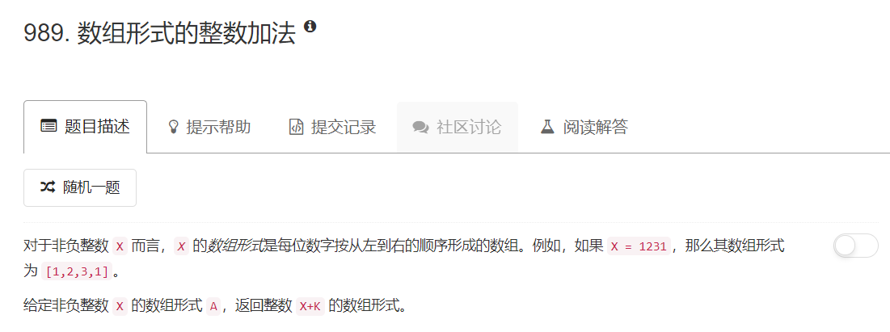
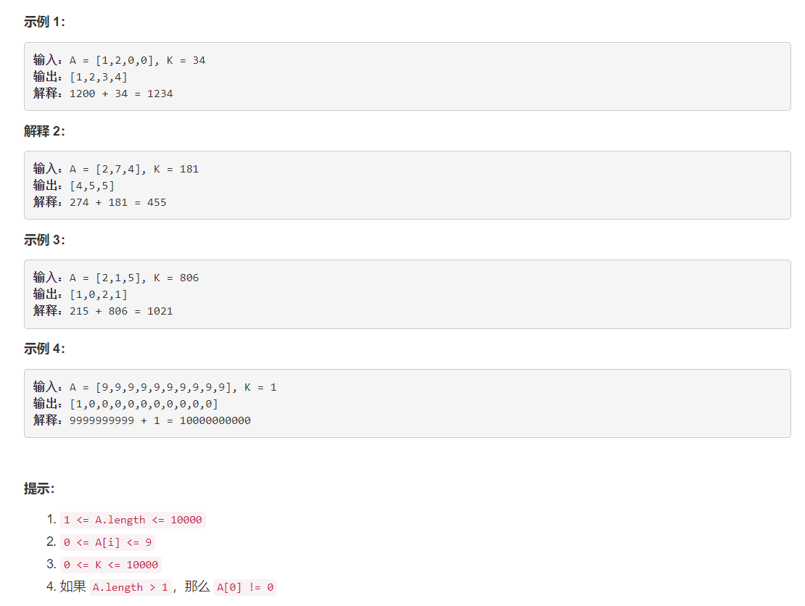

# 989 - 数组形式的整数加法  

## 题目描述




## 题解一
思路：  按加法进位规则从个位开始一个一个加上去。。。  
>注意，如果A比K的位数少，要将其交换位置再计算，否则会索引溢出。


```python
class Solution(object):
    def addToArrayForm(self, A, K):
        """
        :type A: List[int]
        :type K: int
        :rtype: List[int]
        """
        A.reverse()
        K = [int(i) for i in str(K)][::-1]

        the_sum = 0
        len_A, len_K = len(A), len(K)
        if len_A < len_K:
            A, K = K, A
            
        for i in range(len(K)):
            the_sum = A[i] + K[i]
            if the_sum < 10:
                A[i] = the_sum
            else:
                while the_sum >= 10:
                    A[i] = the_sum % 10

                    if i + 1 < len(A):
                        A[i+1] += 1
                    else:
                        A.append(1)

                    the_sum = A[i+1] 
                    i += 1

        return A[::-1]
```

## 题解二
[Java/C++/Python:Take K itself as a Carry](https://leetcode.com/problems/add-to-array-form-of-integer/discuss/234488/JavaC%2B%2BPython-Take-K-itself-as-a-Carry)
太聪明了，思路解释的话，原标题就很清楚了，直接把K当作进位，慢慢把和的个位加到结果上，要是最后K不为0则说明K比A位数长，将其高位加到结果的最前面。
```python
class Solution(object):
    def addToArrayForm(self, A, K):
        """
        :type A: List[int]
        :type K: int
        :rtype: List[int]
        """
        for i in range(len(A))[::-1]:
            the_sum = A[i] + K
            A[i], K = the_sum % 10, the_sum // 10

        if K > 0:
            A = [int(i) for i in str(K)] + A

        return A
```

更简洁的写法：
```python
class Solution(object):
    def addToArrayForm(self, A, K):
        """
        :type A: List[int]
        :type K: int
        :rtype: List[int]
        """
        for i in range(len(A))[::-1]:
            K, A[i] = divmod(A[i] + K, 10)

        return [int(i) for i in str(K)] + A if K else A
        # return list(map(int, str(K))) + A if K else A
```
