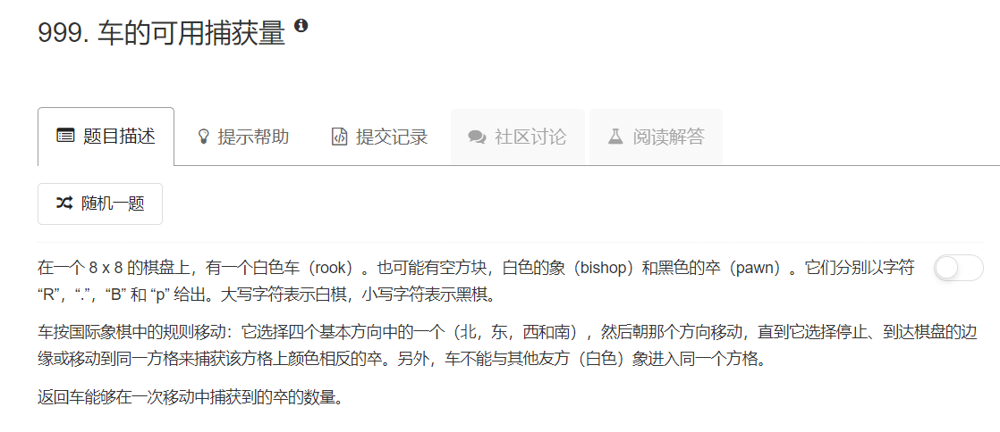
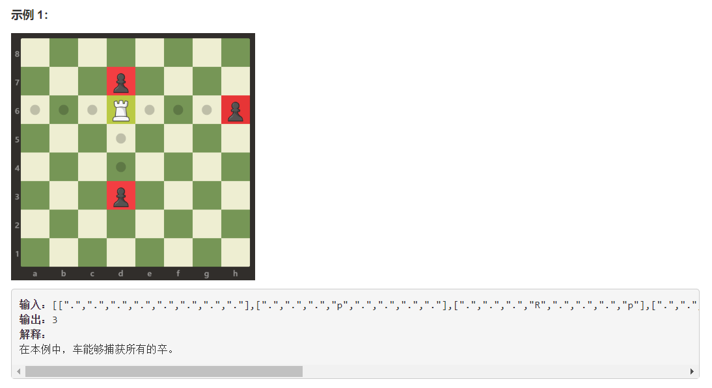
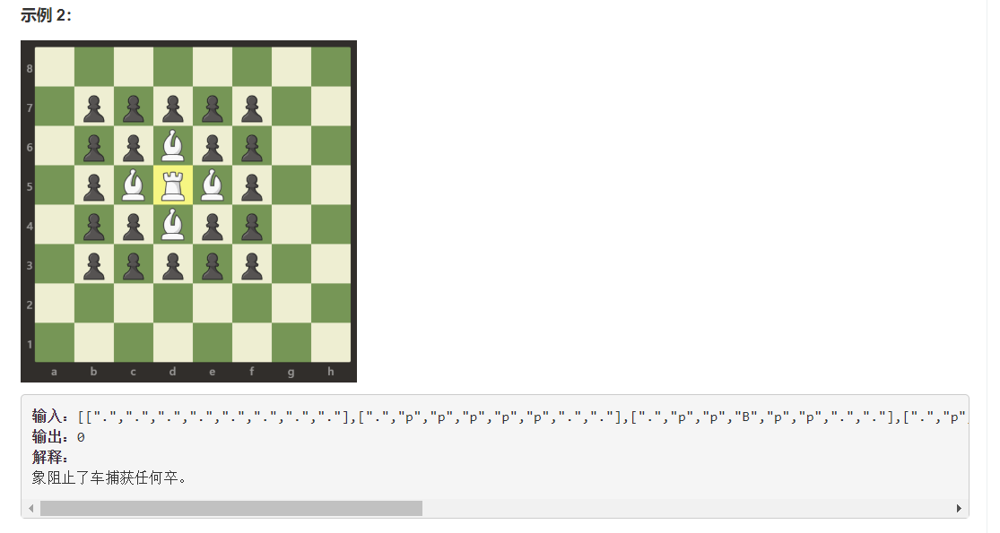
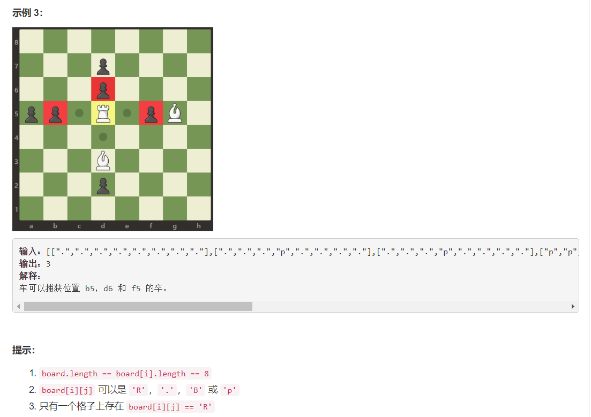

# 999 - 车的可用捕获量  

## 题目描述





>题意：  
这题的示例没办法全截下来，给个链接： [车的可用捕获量](https://leetcode-cn.com/classic/problems/available-captures-for-rook/description/);   
其实就是给定一个棋局，按照车只能直走的走法，找出白车能在可能有白象挡住的情况下干掉几个黑卒。  
使用二维数组表示棋盘，R(rook),B(bishop),P(pawn)分别表示车、象、卒，'.'表示空格。


## 题解一
思路：  
1. 先在二维数组中找出车（R）的索引；
2. 分别往四个方向走，直到在这个方向上遇到白象或者成功干掉一个黑卒；

>感觉垃圾代码被我承包了😂

```python
import numpy as np
class Solution(object):
    def numRookCaptures(self, board):
        """
        :type board: List[List[str]]
        :rtype: int
        """
        r_index = np.where(np.array(board) == 'R')
        r_index = [int(i) for i in r_index]
        row, col = r_index[0], r_index[1]           # 白车的横纵坐标

        count = 0
        for i in range(row - 1, -1, -1):                        # 向上
            if board[i][col] == 'p':
                count += 1
                break
            elif board[i][col] == 'B':
                break
            else:
                continue

        for i in range(row + 1, len(board)):                    # 向下
            if board[i][col] == 'p':
                count += 1
                break
            elif board[i][col] == 'B':
                break
            else:
                continue

        for j in range(col - 1, -1, -1):                        # 向左
            if board[row][j] == 'p':
                count += 1
                break
            elif board[row][j] == 'B':
                break
            else:
                continue

        for j in range(col + 1, len(board[0])):                 # 向右
            if board[row][j] == 'p':
                count += 1
                break
            elif board[row][j] == 'B':
                break
            else:
                continue

        return count
```

## 题解二
找出图算法里面经典的遍历方向，快了一丢丢。

```python
import numpy as np
class Solution(object):
    def numRookCaptures(self, board):
        """
        :type board: List[List[str]]
        :rtype: int
        """
        r_index = np.where(np.array(board) == 'R')
        r_index = [int(i) for i in r_index]
        # row, col = r_index[0], r_index[1]         # 白车的横纵坐标

        count = 0
        dirs = [[0, 1], [0, -1], [1, 0], [-1, 0]]   # 四个方向
        for dir in dirs:
            i, j = r_index[0] + dir[0], r_index[1] + dir[1]
            while 0 <= i < 8 and 0 <= j < 8:
                if board[i][j] == 'p': count += 1
                if board[i][j] != '.': break
                i, j = i + dir[0], j + dir[1]

        return count
```


## 题解三
不用ndarray找白车的坐标，时间还是和2一样，没救了没救了。。

```python
import numpy as np
class Solution(object):
    def numRookCaptures(self, board):
        """
        :type board: List[List[str]]
        :rtype: int
        """
        row, col = 0, 0
        for i in range(len(board)):
            for j in range(len(board[0])):
                if board[i][j] == 'R':
                    row, col = i, j
                    break

        count = 0
        dirs = [[0, 1], [0, -1], [1, 0], [-1, 0]]   # 四个方向
        for dir in dirs:
            i, j = row + dir[0], col + dir[1]
            while 0 <= i < 8 and 0 <= j < 8:
                if board[i][j] == 'p': count += 1
                if board[i][j] != '.': break
                i, j = i + dir[0], j + dir[1]

        return count
```


## 题解四
找到一个咱们华夏同胞的答案哈哈，据说很快就试一下。  

思路：
1. 连接：
 - 遍历找到白车所在那一行，按行把除空格外的棋子都连成字符串，因为这个过程去掉了'.'，就相当于走过了这些空格；
 - 标记白车所在的列，按列依照如上方法连接；
2. 判断：如果在水平和竖直方向上连接后的字符串中有出现"pR"或者"Rp"这样的'R'和'p'相邻的情况就数量加一，因为这代表中间没有白象'B'阻挡。

>牛逼啊朋友！beat 95.45%，虽然第一次只有13%，但我坚信是我的网速问题不是你的方法问题，于是重新提交了一遍，果然还了你你一个清白👌  
[faster than 100% less than 100% with python](https://leetcode.com/problems/available-captures-for-rook/discuss/245250/faster-than-100-less-than-100-with-python)

```python
class Solution(object):
    def numRookCaptures(self, board):
        """
        :type board: List[List[str]]
        :rtype: int
        """

        # 按行连接
        count, col_index = 0, 0
        for row in board:
            if 'R' in row:
                line = ('').join(x for x in row if x != '.')
                if 'pR' in line: count += 1
                if 'Rp' in line: count += 1
                col_index = row.index('R')
                break

        # 按列连接
        col = ('').join( board[i][col_index] for i in range(8) if board[i][col_index] != '.' )
        if 'pR' in col: count += 1
        if 'Rp' in col: count += 1

        return count
```