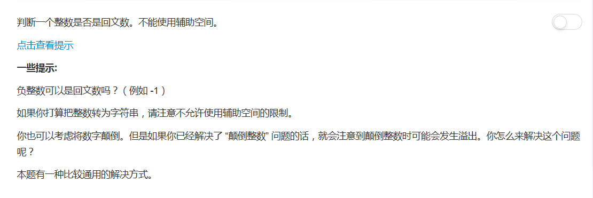

## 题目描述


<!-- more -->

## 思路一：直接颠倒数字
```python
class Solution:
    def isPalindrome(self, x):
        """
        :type x: int
        :rtype: bool
        """

        if x < 0:
            return False

        y = x
        r = 0
        while x > 0:
            r = r*10 + x%10
            x = x // 10
        return r == y
```

## 思路一：转换成字符串颠倒
```python
class Solution:
    def isPalindrome(self, x):
        """
        :type x: int
        :rtype: bool
        """
        if x < 0:
            return False

        x = str(x)
        y = str(x)[::-1]
        return x == y
```

<blockquote class="blockquote-center">这道题是我做了，额，接近十题（惭愧惭愧）以来最最最easy的一题了hiahiahia✧*｡٩(ˊᗜˋ*)و✧*｡ </blockquote>
