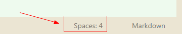
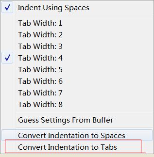
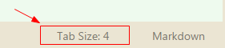

### 1. 缩进错误
>1. IndentationError: unindent does not match any outer indentation level
>2. TabError: inconsistent use of tabs and spaces in indentation

这个错误就像全角半角符号一样让人抓狂，要是想整死一个程序员，就悄悄把他代码里的半角字符换成全角的，他就会开始漫长又愉快的debug~
你永远不知道自己什么时候会出现缩进错误，即使你认为所有地方都使用了tab键ヽ(｀Д´)ﾉ︵ ┻━┻ ┻━┻ 

**解决办法**
1. 老老实实调整，把报错那行重新缩进，确定使用tab 【偶尔有效】
2. 好好看看sublime右下角，怎么是space啊喂！

点击这里，变成tab，文档里的空格就自动变成tab了，你会看到有些小地方闪了一下，就是那些地方的空格让你出错/微笑。

### 2. Git提交文件缺失
**问题：**
Git提交更新时只检测到readme文件的更新并提交，而其他新建的文件则无法检测更新；
**原因：**新建的文件就是这样子的；
**解决：**
1. 使用命令行工具cd到当前repository；
2. git status查看状态，会提醒哪些文件是新建的并且未暂存；
3. git add xxx 暂存这些文件；
4. 回到sourceTree提交。