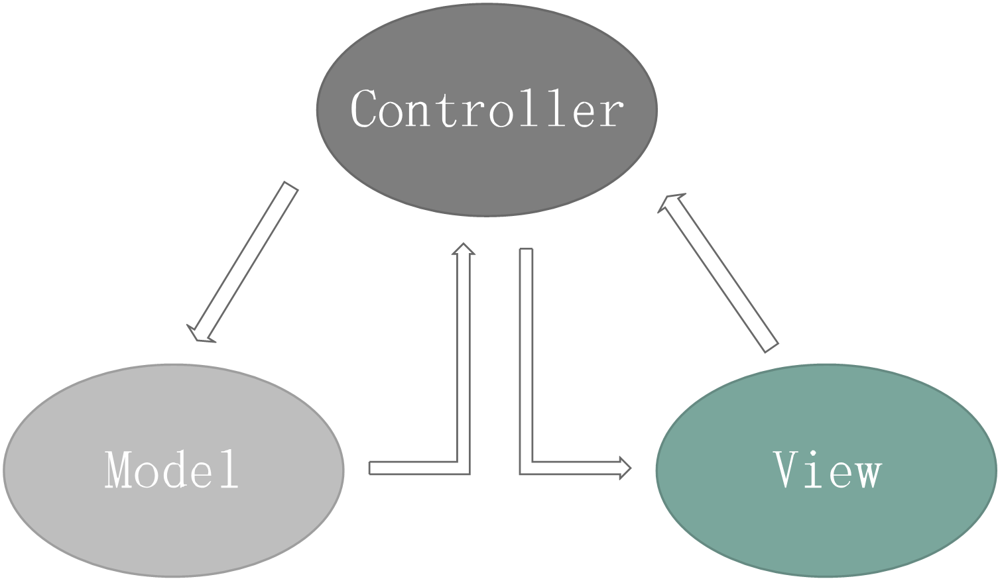
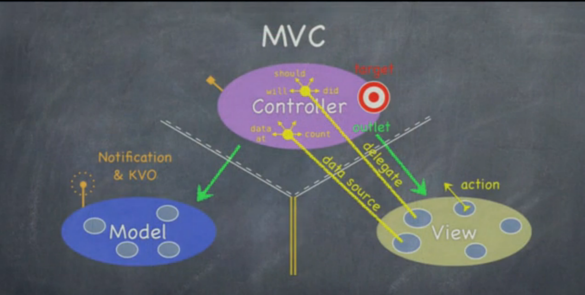
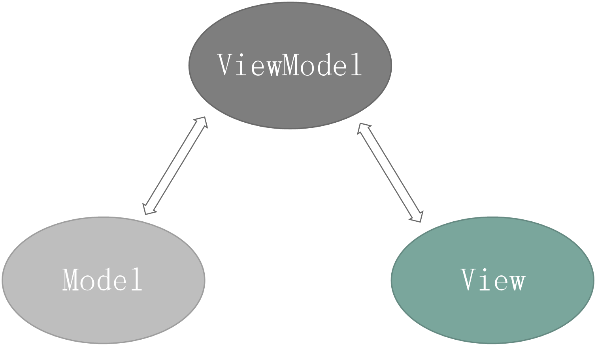

## MVC

### 一、什么是MVC开发模式

M【Model】：模型 
包含应用程序的业务数据和业务逻辑，主要包括业务逻辑模型（包含应用的业务操作，比如订单的添加或者修改等。）和业务数据模型（存放业务数据，比如订单信息、用户信息等​）。由model提供视图的显示数据，同时一个Model可以为多个视图提供业务数据，因此Model可以提高业务的可重用性。

<!-- more -->

V【View】：视图 
即与用户交互的界面，可以给用户显示业务逻辑数据，同时可以接收用户输入的数据。视图层不对数据进行任何的业务逻辑处理。

C【Controller】：控制器 
协调模型与视图，根据视图接收的用户请求来决定调用哪个Model模型来处理业务，同时将处理好的数据传给对应的视图来为用户做出应答。

### 二、MVC处理流程：

用户通过View将参数提交到Controller；
Controller调用对应的Model处理数据；
Controller将处理好的数据输出到对应的View给用户。

### 三、使用MVC的优点

低耦合性：在MVC模式中，模型和视图是解耦的，模型不会依赖于视图，而视图也仅仅是从模型中获取需要展示的数据，并不会与模型的逻辑处理相关联。
更低的开发成本：由于MVC模式帮我们清楚的划分了各部分的职责，就可以让程序员各司其职，Java程序员只关心业务逻辑的实现，也就是模型部分；而界面程序员只关心页面展示，也就是视图部分即可。
更好的可维护性：MVC模式划分出明晰的模型和视图部分，并使其解耦，在软件需求发生变更的时候，就可以各自独立的改变而不会相互影响，使得程序更容易维护和扩展。

## MVP
切断的View和Model的联系，让View只和Presenter（原Controller）交互，减少在需求变化中需要维护的对象的数量。

## MVVM
ViewModel大致上就是MVP的Presenter和MVC的Controller了，而View和ViewModel间没有了MVP的界面接口，而是直接交互，用数据“绑定”的形式让数据更新的事件不需要开发人员手动去编写特殊用例，而是自动地双向同步。为了用一种统一的集中的方式实现频繁需要被实现的数据更新问题。

比起MVP，MVVM不仅简化了业务与界面的依赖关系，还优化了数据频繁更新的解决方案，甚至可以说提供了一种有效的解决模式。

