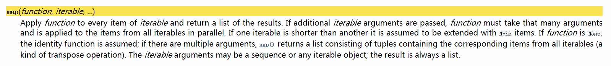

## 一、map函数

`map(function, iterable, ...)`

1. 将函数function应用于iterable中的每一个迭代项，返回一个map对象。
```python
def fun(x):
	return x * x

list1 = [1,2,3]
res = list( map(fun, list1) ) 
print(res)

// 结果： [1, 4, 9]
```

2. 如果给出了额外的可迭代参数，函数必须应用多个参数，且在函数中**并行**的应用每个可迭代参数中的元素。
```python
def fun(a, b, c):
	return a*100 + b*10 + c

list1 = [1,2,3]
list2 = [4,5,6]
list3 = [7,8,9]
res = list( map(fun, list1, list2, list3) ) 
print(res)

// 结果： [147, 258, 369]
```

如果某个iterable比其他的短，那么长度不足的部分会视为None。
```python
def fun(a, b, c):
	return a*100 + b*10 + c

list1 = [1,2,3]
list2 = [4,5,6]
list3 = [7,8]
res = list( map(fun, list1, list2, list3) ) 
print(res)

// 结果： [147, 258]
```

3. 如果function为None... Python3貌似不能将None作为函数名传入了。
```python
list1 = [1,2,3]
res = list( map(None, list1) ) 

// 结果： TypeError: 'NoneType' object is not callable
```

其实吧~~
```python
map(f, iterable)

基本上等于：

[f(x) for x in iterable]
```

## 二、lambda表达式
`lambda [arg1 [, agr2,.....argn]] : expression`
1. lambda表达式中，冒号前面是参数，可以有多个，用逗号分隔，冒号右边是要执行的语句。 
2. lambda创建一个匿名函数，并返回一个函数对象。
