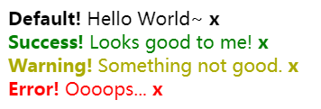
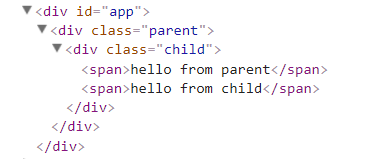
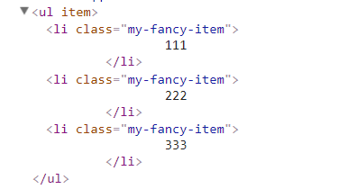

## 如何理解slot
>[如何理解Vue.js的组件中的slot? Jasin Yip的回答](https://www.zhihu.com/question/37548226?sort=created)

slot 有点类似面向对象思想中的「多态」，比如要实现一个这么 Alert 组件：


&lt;slot&gt; 就是外部调用时，标签中的内容。如果外部调用时没有提供内容的话，那么它就会使用自己默认提供的内容，非常方便。

<!--more-->

使用组件：
```html
<div id="app">
	<alert></alert>
	<alert type="success">
	  <strong>Success!</strong> Looks good to me!
	</alert>

	<alert type="warning">
	  <strong>Warning!</strong> Something not good.
	</alert>

	<alert type="error">
	  <strong>Error!</strong> Oooops...
	</alert>
</div>
```

构造组件：
```html
<style>
  .Alert__close {
    font-weight: bold;
    cursor: pointer;
  }
  .Alert--Success {
    color: green;
  }
  .Alert--Warning {
    color: #aa0;
  }
  .Alert--Error {
    color: red;
  }
</style>

<template id="alert-template">
  <div :class="alertClasses"  v-show="show">
    <slot><strong>Default!</strong> Hello World~</slot>
    <span class="Alert__close" @click="show = false">x</span>
  </div>
</template>
```

```javascript
Vue.component('alert', {
  template: '#alert-template',
  props: ['type'],
  computed: {
    alertClasses: function () {
      return {
        'Alert--Success': this.type === 'success',
        'Alert--Warning': this.type === 'warning',
        'Alert--Error'  : this.type === 'error'
      }
    }
  },
  data: function () {
    return {
      show: true
    };
  }
});

new Vue({
  el: '#app'
});
```

## 作用域插槽
>作用域插槽是一种特殊类型的插槽，用作一个 (能被传递数据的)可重用模板，来代替已经渲染好的元素。

### slot-scope 用于 <template>元素
	
在子组件中，只需将数据传递到插槽，就像你将 prop 传递给组件一样。
在父级中，具有特殊特性 slot-scope 的 &lt;template&gt;元素必须存在，表示它是作用域插槽的模板。slot-scope 的值将被用作一个临时变量名，此变量接收从子组件传递过来的 prop 对象。

```html
<div id="app">
	<parent></parent>
</div>

```

```javascript
Vue.component('child',{
	template: '<div class="child">\
		<slot text="hello from child"></slot>\
		</div>'
})

Vue.component('parent', {
	template: '<div class="parent">\
				  <child>\
				    <template slot-scope="props">\
				      <span>hello from parent</span>\
				      <span>{{ props.text }}</span>\
				    </template>\
				  </child>\
				</div>'
})

new Vue({
	el: "#app"
})
```

渲染结果：



### slot-scope 可用于任意元素
作用域插槽更典型的用例是在列表组件中，允许使用者自定义如何渲染列表的每一项：

```html
<div id="app">
	<my-awesome-list :item="items">
		<li
			slot="item"
			slot-scope="props" 
			class="my-fancy-item">
				{{ props.text }}
		</li>
	</my-awesome-list>	
</div>

```

```javascript
Vue.component('my-awesome-list',{
	template: '<ul>\
					<slot name="item"\
						v-for="item in items"\
						:text="item.text">\
						备用内容\
					</slot>\
				</ul>',
	data: function () {
		return {
			items: [
				{text: "111"},
				{text: "222"},
				{text: "333"}
			]
		}
	}
})

new Vue({
	el: "#app",
	data: {
		items: [
			// {text: "111"},
			// {text: "222"},
			// {text: "333"}
		]
	},
	methods: {
		incrementTotal : function () {
			this.total += 1
		}
	}
})

```

渲染结果：

