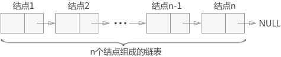
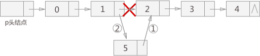
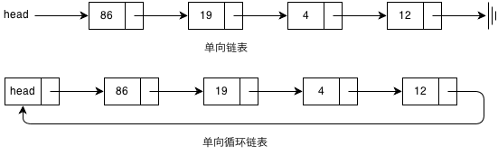
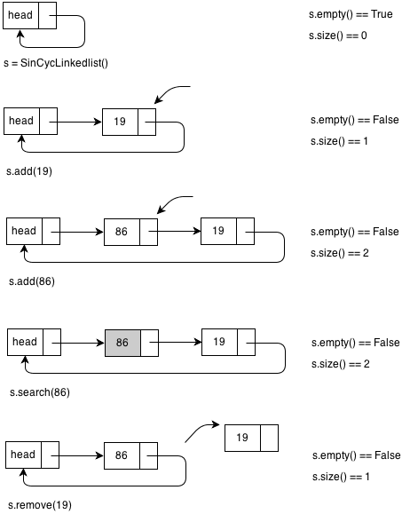

## 一、单链表


<!-- more -->

### 1. 结点类
```python
class ListNode:
	def __init__(self, n):
		self.val = n
		self.next = None
```

### 2. 单链表类
实现基本操作：
1. 初始化
2. 判断是否为空
3. 清空链表
4. 取得链表长度
5. 在链表末尾添加结点
6. 在指定位置添加结点

7. 删除指定位置的结点
8. 替换指定位置结点值
9. 查找指定值所在结点位置
注：[下标均以0开始]

使用表头结点：
表头结点是链表的第一个结点，除了值被忽略以外和其它结点一致，但它不被当做链表中的实际元素。
**头结点的存在使得空链表与非空链表处理一致，也方便对链表的开始结点的插入或删除操作。**

```python
class SinLinkedList:
    def __init__(self):
        self.head = ListNode(None)

    # 是否为空
    def isEmpty(self):
        return self.length() == 0

    # 清空
    def clear(self):
        self.head = ListNode(None)
    
    # 链表长度
    def length(self):
        cnt = 0
        curr = self.head
        while curr.next is not None:
            cnt += 1
            curr = curr.next
        return cnt
        
    # 在链表末尾添加结点
    def append(self, val):
        node = ListNode(val)
        if self.head is None:
            self.head = node
        else:
            p = self.head
            while p.next:
                p = p.next
            p.next = node

    # 在指定位置添加结点
    def insert(self, idx, value):
        if self.isEmpty():
          print('链表为空')

        p = self.head
        new = ListNode(value)
        while p and idx > 0:
            p = p.next
            idx -= 1
        # 说明没有那么多结点
        if idx > 0:
            print('超出链表长度')
        else:
            q = p.next
            p.next = new
            new.next = q

    # 删除指定位置的结点
    def delete(self, idx):
        if self.isEmpty():
          print('链表为空')

        p = self.head
        while p and idx > 0:
            p = p.next
            idx -= 1
        # 说明没有那么多结点
        if idx > 0:
            print('超出链表长度')
        else:
            p.next = p.next.next

    # 替换指定位置结点值
    def replace(self, idx, newValue):
        if self.isEmpty():
          print('链表为空')

        p = self.head
        new = ListNode(newValue)
        while p and idx > 0:
            p = p.next
            idx -= 1
        # 说明没有那么多结点
        if idx > 0:
            print('超出链表长度')
        else:
            q = p.next.next
            p.next = new
            new.next = q

    # 查找第idx个结点值
    def search(self, idx):
        if self.isEmpty():
            print('链表为空')
            return
        p = self.head
        while p.next and idx > 0:
            p = p.next
            idx -= 1
        if idx > 0:
            print('超出链表长度')
        else:
            return p.val

    # 查找指定值所在结点位置
    def index(self, value):
        if self.isEmpty():
            print('链表为空')
            return
        p = self.head
        idx = 0
        while p.next and not p.val == value:
            p = p.next
            idx += 1
        return idx - 1
```

### 3. 测试
```python
l = SinLinkedList()
l.append(12)
l.append(233)
l.insert(1, 666)
l.replace(1, 6666)
l.delete(1)
print(l.index(12))
print(l.search(1))

h = l.head.next
while h:
    print(h.val)
    h = h.next
```

## 二、单向循环链表
特点：从表中任意结点出发均可找到链表中其它结点，查找效率高。


### 1. 节点类-将结点属性设为私有变量
```python
class ListNode:
    def __init__(self, n):
        self.__val = n
        self.__next = None

    def __getVal__(self):
    	return self.__val

    def setVal(self, newVal):
    	self.__val = newVal

    def getNext(self):
    	return self.__next

    def setNext(self, newNext):
    	self.__next = newNext
```

### 2.单向循环链表类
实现基本操作：
1. 初始化
2. 判断是否为空
3. 清空链表
4. 取得链表长度
5. 在头结点后插入结点：头插法
6. 删除指定值的结点
7. 替换指定结点值
8. 查找指定结点并返回下标，不存在返回-1

```python
class SinCycLinkedList:
	def __init__(self):
		self.head = ListNode(None)
		self.head.setNext(self.head)

	# 判断是否为空
	def isEmpty(self):
		return self.head.getNext() == self.head

	# 清空链表
	def clear(self):
		self.head.setNext(self.head)

	# 取得链表长度
	def length(self):
		cnt = 0
		curr = self.head.getNext()
		while curr != self.head:
			curr = curr.getNext()
			cnt += 1
		return cnt

	# 在头结点后插入结点：头插法
	def unshift(self, val):
		new = ListNode(val)
		new.setNext(self.head.getNext())
		self.head.setNext(new)

	# 删除指定值的结点
	def delete(self, val):
		prev = self.head
		while prev.getNext() != self.head:
			curr = prev.getNext()
			if curr.getVal() == val:
				prev.setNext( curr.getNext() )
			prev = prev.getNext()
			
	# 替换指定结点值
	def raplce(self, val, newVal):
		prev = self.head
		while prev.getNext() != self.head:
			curr = prev.getNext()
			if curr.getVal() == val:
				curr.setVal(newVal)
			prev = prev.getNext()

	# 查找指定结点并返回下标，不存在返回-1
	def search(self, val):
		idx = 0
		curr = self.head.getNext()
		while curr != self.head:
			if curr.getVal() == val:
				return idx
			idx += 1
		return -1
```

### 3. 测试
```python
l = SinCycLinkedList()
l.unshift(111)
l.unshift(222)
l.unshift(666)
l.raplce(111, 233)
l.delete(222)
print('666 is in: ', l.search(666))
# l.clear()s
print('length: %d' % l.length())

print('\nitems:')
h = l.head
while h.getNext() != l.head:
	print(h.getNext().getVal())
	h = h.getNext()
```

## 三、双指针
### 链表的环
**判断是否存在环：**
1. 多个结点的后继指针重复；
2. 使用两个移动速度不同的指针，若相遇则存在环。循环条件`(fast != None) && (fast.next != None)`

**寻找环入口：**
1. 快慢指针相遇出就是环的入口；
2. fast指针的移动速度为slow指针的两倍。

### 寻找连续子序列
1. 使用start，end两个指针记录下标

### 移除重复元素

### 倒数第n个结点

### 拆分链表